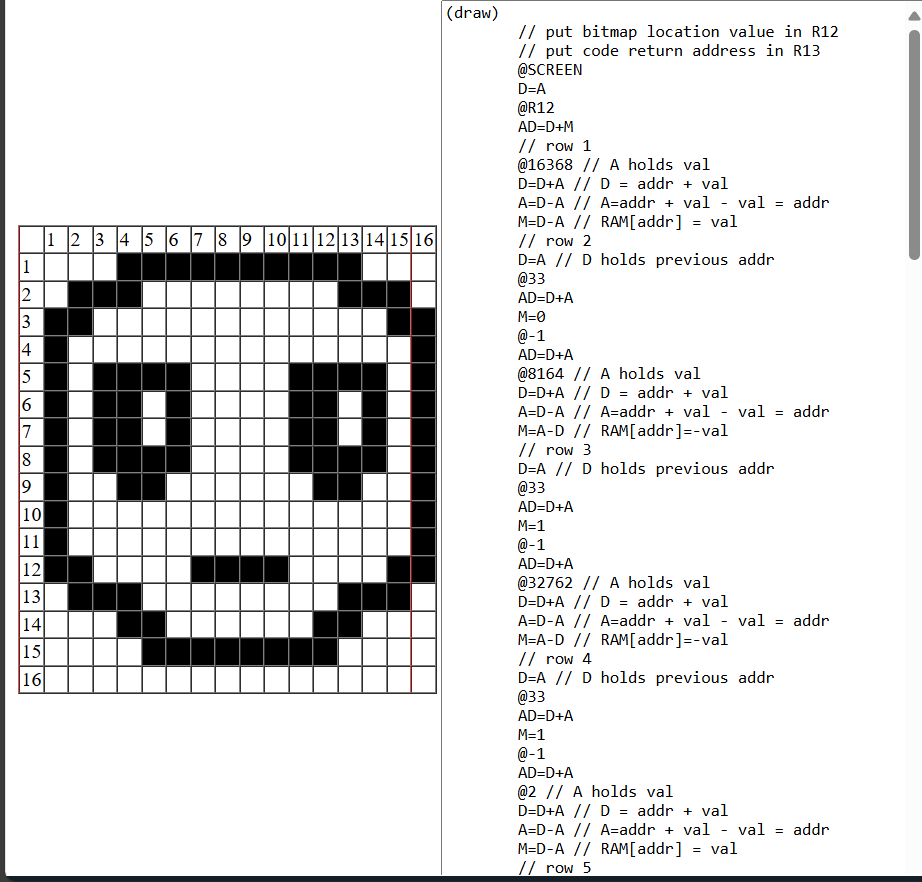

1. 

## Computadora digital

 Una computadora digital es un dispositivo que procesa datos y realiza cálculos. Opera en base a código binario, donde la información se representa usando combinaciones de 0s y 1s y se dividen en diferentes componentes

## Unidad Central de Proceso (CPU)

Es quien ejecuta, interpreta, realiza cálculos y gestiona el flujo de datos diferentes datos de la computadora

## Memoria

Las computadoras digitales usan diferentes tipos de memoria para almacenar información de manera temporal en la RAM (Random Access Memory) o de forma persistente ROM, tambien existe PC y C.

## Dispositivio de Entrada y Salida

Todos los componentes físicos que hay en el computador

 2. 
 # ¿Qué es entonces un programa?

## Un programa

Un programa es un conjunto de instrucciones que le indican a un computador que hacer.

# ¿Qué es un lenguaje ensamblador?
## Lenguaje Ensamblador

Es un lenguaje de bajo nivel de programación que sirve como puente para el lenguaje de alto nivel que sirve como medio para poder controlar la CPU de manera directa sin la necesidad de escribir en binario.

# ¿Qué es lenguaje de máquina?
## Lenguaje de máquina

Es el lenguaje de bajo nivel que funciona directamente con la CPU a traves de codigo binario.

3. 
# ¿Qué son PC, D y A?

## PC

Es quien indica al procesador que accion se debe ejecutar, guarda la direccion de memoria donde esta la siguiente instruccion a ejecutar (Program counter)

## D

Es un registro de proposito general (Guardar dato) 


## A

Es quien se encarga de dar la dirección en la RAM (Adress)

# ¿Para qué los usa la CPU?


# Reto

### 1 Carga en D el valor 1978

```
@1978
D=A
```

### 2 Guarda en la posición 100 de la RAM el número 69

```
@69
D=A
@100
M=D
```

### 3 Guarda en la posición 200 de la RAM el contenido de la posición 24 de la RAM

```
@24
D=M
@200
M=D
```

### 4 Lee lo que hay en la posición 100 de la RAM, resta 15 y guarda el resultado en la posición 100 de la RAM

```
@15
D=A
@100
M=M-D
```

### 4.1 Lee lo que hay en la posición 100 de la RAM, resta 15 y guarda el resultado en la posición 200 de la RAM

```
@15
D=A
@100
D=M-D
@200
M=D
```

### 5 Suma el contenido de la posición 0 de la RAM, el contenido de la posición 1 de la RAM y con la constante 69. Guarda el resultado en la posición 2 de la RAM

```
@69
D=A
@1
D=D+M
@0
D=D+M
@2
M=D
```

### 6 Si el valor almacenado en D es igual a 0 salta a la posición 100 de la ROM

```
@100
D;JEQ
```

### 7 Si el valor almacenado en la posición 100 de la RAM es menor a 100 salta a la posición 20 de la ROM.

```
@100 
D=A 
@100 
D=M-D 
@20 
D;JLT 
```

## 8 Considera el siguiente programa:
```
@var1
D = M
@var2
D = D + M
@var3
M = D
```
# a
## ¿Qué hace este programa?

Lo que hace esto es registrar los datos de *@VAR1* y *@VAR2*, sumarlos y almacenar los datos en *@VAR3*

# b
## En qué posición de la memoria está var1, var2 y var3? ¿Por qué en esas posiciones?

*@VAR1*, *@VAR2* y *@VAR3* Estan almacenadas en la diección @16,@17 y @18 respectivamente

## 9 Considera el siguiente programa:
```
i = 1
sum = 0
sum = sum + i
i = i + 1
```
# a
## ¿Qué hace este programa?
Lo que hace el programa es declarar 2 variables, ```i``` y ```sum```, asignandoles el valor de 1 y 0 respectivamente, ademas hace una suma entre ```sum``` e ```i``` y almacenar el resultado en ```sum``` y  sumarle 1 al valor de  ```i``` 
# b
## ¿En qué parte de la memoria RAM está la variable i y sum? ¿Por qué en esas posiciones?

Es arbitrario donde se encuentran ya que son variables y no se especifica donde estan 

# c
## Optimiza esta parte del código para que use solo dos instrucciones:

```
@i 
M=M+1
```
### 10
## Las posiciones de memoria RAM de 0 a 15 tienen los nombres simbólico R0 a R15. Escribe un programa en lenguaje ensamblador que guarde en R1 la operación 2 * R0.

```
@R0
D=M
D=D+M
@R1
M=D
```

## 11
## Considera el siguiente programa:  
```
i = 1000
LOOP:
if (i == 0) goto CONT
i = i - 1
goto LOOP
CONT:
```

### a
## ¿Qué hace este programa?

Lo que hace el programa es ser un contador de 1000 a 0

### b
## ¿En qué memoria está almacenada la variable i? ¿En qué dirección de esa memoria?

Esta en una direccion arbitraria ya que ```@i``` es una variable cualquiera

### c
## ¿En qué memoria y en qué dirección de memoria está almacenado el comentario //i = 1000?

Se encuentra en la ROM estando en la direccion de ```0``` ya que es la primera instruccion que se le da a un programa

### d
## ¿Cuál es la primera instrucción del programa anterior? ¿En qué memoria y en qué dirección de memoria está almacenada esa instrucción?

Poner ```@1000``` en ```A ``` y está almacenada en la ROM en dirección @1

### e
## ¿Qué son CONT y LOOP?

Son etiquetas (tags)

### f
## ¿Cuál es la diferencia entre los símbolos i y CONT?

@i indica la posicion en RAM de la variable i
@CONT indica la posicion en ROM de la etiqueta CONT

## 12 Implemente en ensamblador:
```R4 = R1 + R2 + 69```
## .

```
@69
D=A
@R2
D=D+M
@R1
D=D+M
@R4
M=D
```

## 13 Implementa en ensamblador:
```
if R0 >= 0 then R1 = 1
else R1 = –1

(LOOP)
goto LOOP
```
## .

```
@R0
D=M
@POSITIVE
D;JGE        
@NEGATIVE
0;JMP        

(POSITIVE)
@1
D=A           
@R1
M=D           
@LOOP
0;JMP         

(NEGATIVE)
@1
D=-A          
@R1
M=D           
@LOOP
0;JMP         

(LOOP)
@LOOP
0;JMP
```

## 14 Implementa en ensamblador:
``` R4 = RAM[R1] ```
## .
```
@R1
A=M 
D=M 
```

## 15 Implementa en ensamblador el siguiente problema. En la posición R0 está almacenada la dirección inicial de una región de memoria. En la posición R1 está almacenado el tamaño de la región de memoria. Almacena un -1 en esa región de memoria.
## . 

```
@1
D=-A
@R0
A=M
M=D
```

## 16 Implementa en lenguaje ensamblador el siguiente programa:
```
int[] arr = new int[10];
int sum = 0;
for (int j = 0; j < 10; j++) {
    sum = sum + arr[j];
}
```
```
@256   
D=A
@addrArr
M=D   
@0
D=A
@sum
M=D     
@0
D=A
@j
M=D   
(LOOP)
@j
D=M    
@10
D=D-A   
@END
D;JGE   
@addrArr
D=M   
@j
A=D+M   
D=M    
@sum
M=M+D  
@j
M=M+1
@LOOP
0;JMP
@END
0;JMP   

```
# a ¿Qué hace este programa?


El programa suma todos los digitos del Array

# b ¿Cuál es la dirección base de array en la memoria RAM?

La dirección del array es la 256 en la RAM y los 10 elementos del ```Array``` se almacenan de forma continua

# c ¿Cuál es la dirección base de sum en la memoria RAM y por qué?

La dirección base de sum es 10 despues de la direccion base del array porque el array ocupa 10 espacios

# d ¿Cuál es la dirección base de j en la memoria RAM y por qué?

La dirección de j está una posicion despues de sum, porque justo despues de declarar a sum declara a j

## 17 Implementa en lenguaje ensamblador:
```
if ( (D - 7) == 0) goto a la instrucción en ROM[69]
```
## .

```    
D=D-A    
@69     
D;JEQ   
```

## 18 Utiliza la herramienta para dibujar un bitmap en la pantalla.



## 19 Analiza el siguiente programa en lenguaje de máquina:

```
@16384 
D=A 
@16 
M=D 
@24576 
D=M 
@19 
D;JNE 
@16 
D=M 
@16384 
D=D-A 
@4 
D;JLE 
@16 
AM=M-1 
M=0 
@4 
0;JMP 
@16 
D=M 
@24576 
D=D-A 
@4 
D;JGE 
@16 
A=M 
M=-1 
@16 
M=M+1 
@4 
0;JMP  
```
# a ¿Qué hace este programa?
Lo que hace el programa es generar pixeles en la pantalla cada que detecta algun input del tecaldo 

## 20 Implementa un programa en lenguaje ensamblador que dibuje el bitmap que diseñaste en la pantalla solo si se presiona la tecla “d”.
```
@24576 
D=M 
@100 
D=D-A 
@0
D;JNE 
@8184 
D=A 
@16384 
M=D 
@28686 
D=A 
@16416 
M=D 
@16381 
D=-A 
@16448 
M=D 
@32767 
D=-A 
@16480 
M=D 
@17347 
D=-A 
@16512 
M=D 
@19403 
D=-A 
@16544 
M=D 
@19403 
D=-A 
@16576 
M=D 
@17347 
D=-A 
@16608 
M=D 
@26599 
D=-A 
@16640 
M=D 
@32767 
D=-A 
@16672 
M=D 
@32767 
D=-A 
@16704 
M=D 
@15421 
D=-A 
@16736 
M=D 
@28686 
D=A 
@16768 
M=D 
@6168 
D=A 
@16800 
M=D 
@4080 
D=A 
@16832 
M=D 
@0 
D=A 
@16864 
M=D 
```