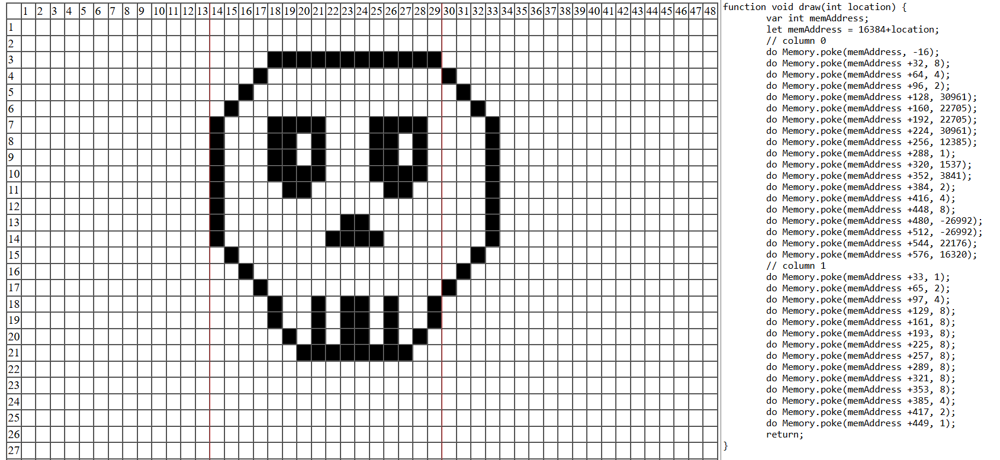

## Computadora digital
 Una computadora digital es un dispositivo que procesa datos y realiza cálculos. Opera en base a código binario, donde la información se representa usando combinaciones de 0s y 1s y se dividen en diferentes componentes

## Unidad Central de Proceso (CPU)
Es quien ejecuta e interpreta, realiza cálculos y gestiona el flujo de datos diferentes datos de la computadora

## Memoria
Las computadoras digitales usan diferentes tipos de memoria para almacenar información de manera temporal en la RAM (Random Access Memory) o de forma persistente.

## Dispositivio de Entrada y Salida
Todos los competentes físicos que hay en el computador

 2. 
## Un programa
Un programa es un conjunto de instrucciones que le indican a un computador que hacer 
 
## Lenguaje Ensamblador
Es un lenguaje de bajo nivel de programación que sirve como puente para el lenguaje de alto nivel que sirve como medio para poder controlar la CPU de manera directa sin la necesidad de escribir en binario.

## Lenguaje de máquina

Es el lenguaje de bajo nivel que funciona directamente con la CPU a traves de codigo binario.

3. 

## PC
Es quien indica al procesador que accion se debe ejecutar, guarda la direccion de memoria donde esta la siguiente instruccion a ejecutar

## D
Es un regustro de proposito general 

## A
Es un registro de proposito general 

4. 

@100
D = A
@32
M = D

# Reto
# RETO
### 1 Carga en D el valor 1978.

```
@1978
D=A
```

### 2 Guarda en la posición 100 de la RAM el número 69.

```
@69
D=A
@100
M=D
```

### 3 Guarda en la posición 200 de la RAM el contenido de la posición 24 de la RAM.

```
@24
D=M
@200
M=D
```

### 4 Lee lo que hay en la posición 100 de la RAM, resta 15 y guarda el resultado en la posición 100 de la RAM.

```
@15
D=A
@100
M=M-D
```

### 4.1 Lee lo que hay en la posición 100 de la RAM, resta 15 y guarda el resultado en la posición 200 de la RAM.

```
@15
D=A
@100
D=M-D
@200
M=D
```

### 5 Suma el contenido de la posición 0 de la RAM, el contenido de la posición 1 de la RAM y con la constante 69. Guarda el resultado en la posición 2 de la RAM.

```
@69
D=A
@1
D=D+M
@0
D=D+M
@2
M=D
```

### 6 Si el valor almacenado en D es igual a 0 salta a la posición 100 de la ROM.
```
@100
D;JEQ
```
## 7
```
@100 
D=A 
@100 
D=M-D 
@20 
D;JLT 
```
## 8
# a
Lo que hace esto es registrar los datos de *@VAR1* y *@VAR2*, sumarlos y almacenar los datos en *@VAR3*

# b

## 9

## 10
```
@R0
D=M
D=D+M
@R1
M=D
```
## 11
### a
Lo que hace el programa es ser un contador de 1000 a @0
### b


### c
Se encuentra en la ROM estando en la dirección @0

### d
Almacenar el valor @1000 en A y está alamacenada en la ROM en dirección @1

### e
Son etiquetas (tags)

### f
@i indica la posicion en RAM de la variable i
@CONT indica la posicion en ROM de la etiqueta CONT

## 12
```
@69
D=A
@R2
D=D+M
@R1
D=D+M
@R4
M=D
```

## 13
```
@R0
D=M
@POSITIVE
D;JGE        
@NEGATIVE
0;JMP        

(POSITIVE)
@1
D=A           
@R1
M=D           
@LOOP
0;JMP         

(NEGATIVE)
@1
D=-A          
@R1
M=D           
@LOOP
0;JMP         

(LOOP)
@LOOP
0;JMP
```

## 14
```
@R1
D=A
@R4
M=D
```
## 15
```
@1
D=-A
@R0
A=M
M=D
```
## 16
# a
El programa suma todos los digitos del Array

# b
La dirección del array es 
# c
La dirección base de sum es 10 despues de la direccion base del array porque el array ocupa 10 espacios
# d
J la dirección de j está una despues de sum es porque justo despues de encontrar a sum encuentra j

## 17
```
@D    
D=M    
@7     
D=D-A    
@69     
D;JEQ   
```
## 18


## 19
```
@16384 
#ERR 
@32 
@6208 
D&A 
#ERR  
@19
D=A;JLT
@32 
D=M 
@16384 
D=D-A 
@4 
D;JLE 
@16 
AM=M-1 
M=0 
@4 
0;JMP 
@16 
D=M 
@24576 
D=D-A 
@4 
D;JGE 
A=M 
M=-1 
@16 
M=M+1 
@4 
0;JMP 
```
## 20


